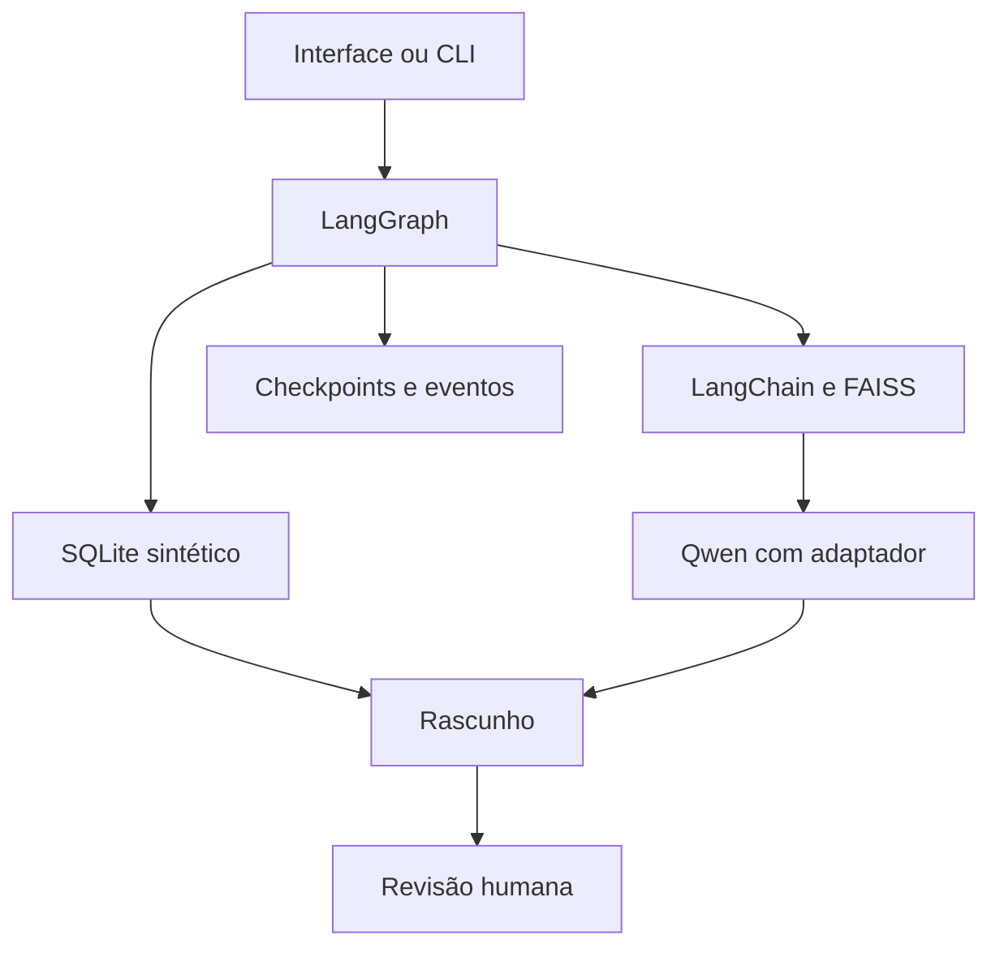

# Relatório final — assistente hospitalar acadêmico

Status: MODELO PARA PREENCHIMENTO. Não é relatório de validação concluída.

## Problema e escopo

Consulta a protocolos e dados sintéticos, com modelo ajustado, recuperação de
contexto e revisão humana. Cenário didático; sem uso clínico ou dados reais.

## Dados e preparação

MedQuAD: revisão 577bd37b96c02d1833b2c9eed2de9f96964e96cb, coleções NIDDK/NHLBI,
750 pares selecionados, 572/78/100 em treino/validação/teste. Explicar limpeza,
deduplicação, agrupamento, licenças e exclusões com docs/data-card.md.
Tradução e revisão clínica: PENDENTES. Protocolos/pacientes são sintéticos.

## Treinamento

Qwen2.5-0.5B-Instruct com LoRA e quantização NF4. Incluir configuração efetiva,
hashes, número efetivamente usado no treino, hardware, passos, tempo e memória
a partir dos artefatos da execução. Não confundir os 750 selecionados com exemplos
que couberam no limite de tokens. Evidências a anexar: PENDENTES.

## Arquitetura

Explicar separação entre RAG e consultas determinísticas; citar as bibliotecas
nas requirements. Laudo é formulário sem diagnóstico; receita é formulário vazio.
O operador escolhe a rota; o modelo não realiza planejamento autônomo de ferramentas.

## Avaliação

- Testes de código e fluxo: PENDENTES — anexar saída e versões.
- Recuperação: PENDENTE — anexar métricas e denominadores.
- Geração e revisão humana: PENDENTES — analisar exemplos corretos e incorretos.
- Comparação base/ajustado: somente 2/100 exemplos, resultados mistos; não comprova melhoria.
- Interface e persistência no Windows: PENDENTES.

## Limitações e próximos passos

Modelo pequeno, restrição de memória, exclusão de exemplos longos, perguntas de
avaliação didáticas, possível alucinação, limiar de busca não calibrado e ausência
de autenticação. Preservar limites conhecidos mesmo após testes técnicos passarem.
Explicar eventuais alterações em relação às aulas e ao enunciado, sem afirmar que
revisão de IDs de citação garante sustentação factual.

## Conclusão

PREENCHER SOMENTE APÓS A AVALIAÇÃO. Distinguir implementação, viabilidade técnica,
qualidade observada e requisitos que permaneceram pendentes.
