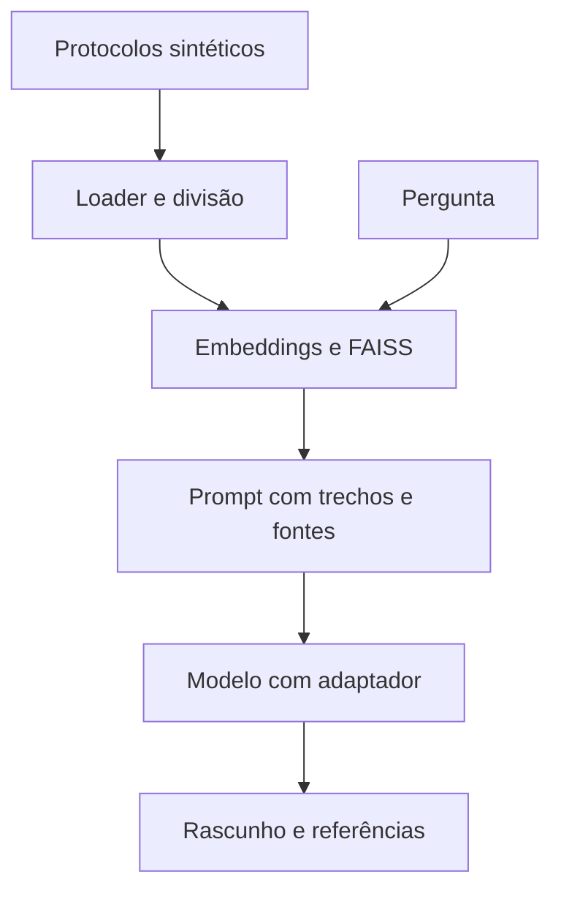

# Fase 3 — LangChain e RAG local

Implementação entregue para execução posterior. Não foram executados testes,
instalação das novas dependências, downloads de embeddings ou inferência RAG nesta
PR, conforme combinado. A compatibilidade do ambiente e a qualidade das respostas
precisam ser verificadas antes de considerar esta fase validada.

## Componentes

- TextLoader lê somente os protocolos PR-*.txt da pasta configurada. MedQuAD,
  prontuários e exemplos de avaliação não entram no índice.
- RecursiveCharacterTextSplitter divide textos com posição e identidade da fonte.
- HuggingFaceEmbeddings multilíngue roda em CPU, com vetores normalizados.
- A revisão do encoder é resolvida para SHA durante a indexação e reutilizada nas
  consultas. O índice JSON guarda vetores, trechos e hashes dos documentos.
- FAISS é reconstruído em memória a partir desses vetores, sem pickle. Não é
  necessário recalcular os embeddings dos documentos em cada consulta.
- ChatPromptTemplate e RunnableLambda compõem a chain LCEL; Transformers e PEFT
  carregam a revisão do modelo base e o adaptador da execução concluída.
- Fontes recuperadas, fontes efetivamente incluídas no prompt e referências citadas
  são campos distintos. IDs de citação são conferidos; sustentação semântica não.



## Preparação para executar depois

Na raiz do repositório, mantendo o PyTorch CUDA já instalado:

```powershell
.\.venv\Scripts\python.exe -m pip install -r requirements/rag.txt
.\.venv\Scripts\python.exe -m pip install -e .
.\.venv\Scripts\hospital-rag.exe index
.\.venv\Scripts\hospital-rag.exe retrieve "O que fazer quando um exame está pendente?"
.\.venv\Scripts\hospital-rag.exe ask "O que fazer quando um exame está pendente?" --output runs/rag-answer-01.json
.\.venv\Scripts\hospital-rag.exe chat
```

A primeira indexação baixa o encoder. A primeira geração pode baixar a base se
não estiver no cache. Não há API paga nem chave de serviço. O chat não conserva
histórico: cada pergunta é independente. /sair encerra.

`config/rag.json` aponta para `runs/qlora-mx150-01`. Essa pasta deve conter
metrics.json, resolved_config.json e adapter/ da fase 2. Probe não é aceito.

Por padrão a geração usa CPU FP32 e embeddings sempre usam CPU. Isso aproveita a
RAM disponível e evita depender da VRAM de 2 GB para o contexto RAG; desempenho
não foi medido. Para usar NF4/CUDA, copie a configuração e altere device para cuda:

```powershell
.\.venv\Scripts\hospital-rag.exe --config config/rag-cuda.json ask "Como identificar o paciente?"
```

O arquivo rag-cuda.json deve ser criado pelo usuário a partir do padrão. Não há
fallback automático em caso de OOM. Orçamento inicial: 512 tokens de entrada,
96 de saída e até 2 trechos; parâmetros independentes do limite de treino de 128.
Trechos que não cabem são omitidos integralmente e registrados como recuperados,
mas não como contexto. Perguntas que excedem 128 tokens do encoder são recusadas para evitar truncamento
silencioso; prompts que não comportam trechos retornam contexto insuficiente.

## Busca e referências

max_distance=0.9 é um limiar inicial **não calibrado**, em distância L2 quadrática
entre vetores normalizados (menor é melhor). Não representa probabilidade de
correção. Calibrar posteriormente com perguntas de validação, incluindo perguntas
sem resposta. Fontes não atualizadas provocam erro por hash: para reindexar,
selecione outra pasta em index. Índices e respostas existentes não são sobrescritos.

Sem trechos aceitos, a resposta é determinística e informa contexto insuficiente.
Com contexto, o modelo produz um rascunho: referências ausentes ou desconhecidas
recebem citation_review_required; saída que atinge o limite sem EOS é incomplete.
Esses sinais não constituem verificação factual. O modelo pode alucinar mesmo com
citações válidas. O conteúdo e as fontes permanecem visíveis para revisão humana.

## Validação posterior

1. Instalar dependências e construir o índice, verificando os oito protocolos.
2. Inspecionar retrieve com perguntas conhecidas e sem cobertura, ajustando o limiar
   somente com o conjunto de validação definido para RAG.
3. Rodar ask, conferir os trechos enviados, referências e fidelidade da resposta.
4. Conferir contexto insuficiente, documento alterado, saída existente, adaptador
   ausente, orçamento insuficiente e saída interrompida pelo limite.
5. Medir tempo/RAM em CPU; testar CUDA separadamente se desejado, registrando OOM.

A fase 2 demonstrou treinamento local, mas a comparação enviada avaliou somente
2 de 100 casos e não demonstrou melhoria na qualidade. RAG também ainda não foi
validado. LangGraph, ferramentas de pacientes, aprovação persistente e interface
web pertencem à fase 4; esta PR fornece somente consulta a protocolos.

Referências de implementação:
- https://docs.langchain.com/oss/python/integrations/embeddings/sentence_transformers
- https://huggingface.co/docs/peft/en/package_reference/peft_model
