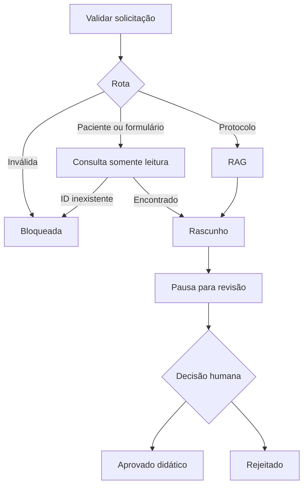

# Fase 4 — fluxo persistente com LangGraph

Código entregue; instalação, execução e testes desta fase ainda pendentes por
solicitação do usuário. A checagem básica da fase 3 passou no Windows (pip check,
imports e ajuda), mas indexação e geração RAG ainda não foram validadas.

## Fluxo

StateGraph com estado tipado, rotas condicionais, ferramentas LangChain,
checkpoints SQLite, interrupt e Command(resume=...). Cada solicitação possui UUID
próprio e histórico de eventos persistido no estado. A rota é escolhida explicitamente
pelo usuário: o modelo não decide ferramentas, não escreve SQL nem altera pacientes.



Rotas: protocol, patient, exams, report e prescription. Consultas de paciente e
exames preservam os valores do banco. Laudo é um formulário com resultados
registrados, ausências e campo de revisão, sem interpretação diagnóstica. Receita
é formulário vazio para preenchimento profissional: não recomenda drogas ou doses.
O RAG reutiliza o modelo ajustado e só é carregado na rota protocol.

Toda saída bem-sucedida aguarda revisão. Não é necessário carregar modelo ou GPU
para consultar pacientes, gerar formulários, consultar estado ou registrar decisão.
A aprovação refere-se ao hash do rascunho exibido; reenvio sequencial ou concorrente
é recusado após decisão. Um lock de arquivo serializa as operações locais; o SQLite
é fechado ao terminar cada operação. Não há envio, assinatura ou prescrição efetiva.

## Instalar e executar depois

Na raiz do projeto:

```powershell
.\.venv\Scripts\python.exe -m pip install -r requirements/workflow.txt
.\.venv\Scripts\python.exe -m pip install -e .
.\.venv\Scripts\python.exe -m pip check
.\.venv\Scripts\hospital-data.exe seed
.\.venv\Scripts\hospital-workflow.exe start exams --patient-id SYN-P001
```

Copie thread_id e draft_hash da saída. Consulte e revise em comandos separados:

```powershell
.\.venv\Scripts\hospital-workflow.exe show "ID_DA_SOLICITACAO"
.\.venv\Scripts\hospital-workflow.exe review "ID_DA_SOLICITACAO" --decision approve --reviewer "Wesley" --draft-hash "HASH_DO_RASCUNHO" --comment "Revisão didática"
```

Para rejeitar, use --decision reject. Para iniciar outras rotas:

```powershell
.\.venv\Scripts\hospital-workflow.exe start patient --patient-id SYN-P001
.\.venv\Scripts\hospital-workflow.exe start report --patient-id SYN-P001
.\.venv\Scripts\hospital-workflow.exe start prescription --patient-id SYN-P001
.\.venv\Scripts\hospital-workflow.exe start protocol --question "O que fazer com exame pendente?"
```

A rota protocol exige indexação da fase 3 e adaptador treinado. Falhas de execução
ficam com status failed e histórico; para repetir após correção, crie nova solicitação.
Patient ID inválido/inexistente fica blocked sem rascunho para aprovação.

## Interface local

```powershell
.\.venv\Scripts\python.exe -m streamlit run src/hospital_assistant/workflow/ui.py --server.address 127.0.0.1
```

A página permite iniciar solicitações, visualizar rascunhos e fontes, aprovar ou
rejeitar e consultar eventos. Para recuperar uma solicitação após fechar o programa,
cole seu UUID na barra lateral. O registro permanece em data/local/workflows.sqlite3.
O nome de revisor é informado pelo operador; não há autenticação ou comprovação de
identidade profissional. Interface destinada à demonstração local, não a múltiplos
usuários em produção. Aprovação didática não é validação clínica.

## Verificações previstas para a etapa de testes

- ID inválido e inexistente bloqueiam sem inventar paciente.
- SYN-P001 mantém exame pendente com resultado ausente.
- Laudo não completa resultados; receita mantém campos vazios.
- Encerrar e reabrir preserva rascunho, hash, pausa e eventos.
- Aprovar/rejeitar exige revisor e hash corretos; segunda decisão é recusada.
- Rota de protocolos preserva fontes e indicadores de contexto insuficiente.
- Erro de modelo/índice retorna failed; consultas ao banco continuam independentes.
- Conferir interface, fechamento do SQLite no Windows e instalação das versões.

Nenhum desses testes foi executado nesta PR. A fase 5 consolida a avaliação e as
evidências, sem presumir que RAG ou LangGraph já tenham sido validados.

Referência: https://docs.langchain.com/oss/python/langgraph/interrupts
